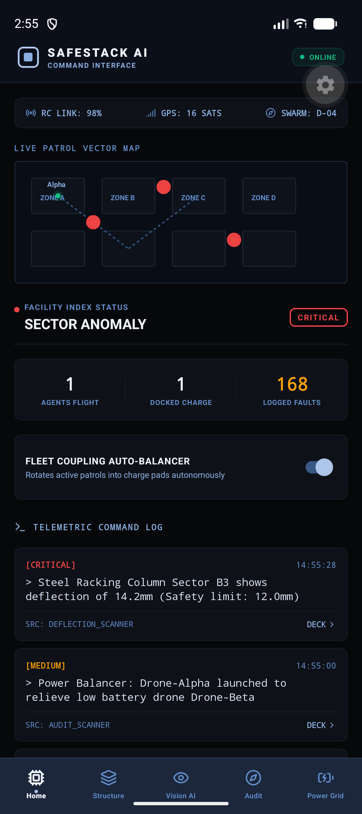

# SafeStack AI: Multi-Agent Mobile Structural Diagnostics & Thermal Hazard Patrol Ecosystem



An autonomous, zero-GPS warehouse auditing infrastructure and companion Android-based monitoring gateway for heavy manufacturing facilities and logistics hubs.

Production Repository Blueprint • Target Version v1.0.0-Core-Spec • Last Updated June 30, 2026 • Compliance: OSHA §1910.176 & NFPA 70B

[](#tech-stack)
[](#tech-stack)
[](#implementation-roadmap)

This repository expands an offline-first mobile command gateway into a multi-disciplinary logistics safety infrastructure, bridging autonomous flight robotics, multispectral radiometric hazard scanning, local CNN weld rust oxidation modeling, and real-time sqlite database caching.

---

## Table of Contents
1. [Problem Landscape](#problem-landscape)
2. [System Architecture & Innovation](#system-architecture--innovation)
3. [High-Fidelity Android Interface UI](#high-fidelity-android-interface-ui)
4. [Technical Specifications](#technical-specifications)
5. [Core AI Models & Algorithmic Frameworks](#core-ai-models--algorithmic-frameworks)
6. [Tech Stack](#tech-stack)
7. [Project Composition](#project-composition)
8. [24-Month Implementation Roadmap](#24-month-implementation-roadmap)
9. [Repository Structure](#repository-structure)
10. [Getting Started](#getting-started)
11. [Live Interactive Mockup Deploy](#live-interactive-mockup-deploy)

---

## Problem Landscape

High-volume manufacturing facilities and heavy logistics hubs operate under extreme asset utilization rates. Warehouses maximize storage density through vertical, multi-tier steel racking systems. This environment introduces critical structural and electrical failure vectors:

*   **Structural Column Deflection**: Forklift impacts and seismic events introduce micro-deviations in vertical steel columns. Left undetected, deflection exceeding safety tolerances causes catastrophic progressive rack collapse.
*   **Radiometric Thermal Anomalies**: Continuous battery charging loops and high-load distribution panels generate hot spots. Early-stage wire degradation remains undetected by standard inspections until thermal runaway occurs.
*   **Weld Oxidation Decay**: High-humidity and chemical environments accelerate rust oxidation at structural weld joints, slowly compromising roof trusses.

Traditional safety audits are manual, periodic, and error-prone. SafeStack AI automates this process through autonomous patrol agents and a centralized mobile HUD console.

---

## System Architecture & Innovation

SafeStack AI implements a dual-layer auditing framework:

1.  **Autonomous Auditing Swarm**: Quadcopters equipped with UWB positioning sensors, radiometric thermal cameras, and high-resolution RGB visual sensors navigate zero-GPS interiors under off-hour shifts.
2.  **Centralized Mobile Gateway**: A React Native command interface that parses telemetry stream inputs, maintains an offline-first SQLite cache, and syncs anomaly records to a Supabase cloud database.

```
       [ Autonomous Drone Fleet ]
                   |
                   v (UWB Local Positioning)
    +------------------------------+
    |  Local WebSocket Telemetry  |
    +------------------------------+
                   |
                   v
    +------------------------------+
    |      Android Gateway         |
    |  - SQLite Offline Cache      | <---> [ Supabase Cloud Sync ]
    |  - Auto Battery Balancer     |
    +------------------------------+
                   |
                   v
     [ Obsidian HUD Cockpit UI ]
```

---

## High-Fidelity Android Interface UI

The mobile console maps autonomous sensor captures directly to the operator interface through five dedicated dashboards:

*   **Tactical Telemetry HUD (Home)**: Displays a vector-based SVG map of the warehouse grid with pulsing active drone nodes, real-time signal links, and incident timeline feeds.
*   **Structural Load matrix (Structure)**: Visualizes vertical deflection curvatures using real-time quadratic bezier equations. Includes diagnostic calibration switches to test threshold limits.
*   **Multispectral Radiometric Grid (Vision AI)**: Consolidates thermal heat map arrays and weld inspection camera viewports equipped with target bounding boxes and focal HUD overlays.
*   **Swarm Sweep sequence (Audit)**: Controls emergency sweep checklists, detailing progression levels across different sectors.
*   **Inductive Pad Balancer (Power Grid)**: Monitors charging wattage and temperature indices for individual docking slots.

---

## Technical Specifications

### Hardware Architecture (Drone Auditing Nodes)
*   **Internal Thermal Envelope**: Aerogel insulation enclosing LiPo battery arrays to sustain cell voltage stability when operating near cryogenic or cold-storage sectors.
*   **UWB Spatial Positioning**: Decawave transceivers computing relative distance vectors to localized anchors for zero-GPS indoor flight paths.
*   **Multispectral Payload**: FLIR radiometric thermal module (pixel-by-pixel temperature evaluation) alongside a global shutter RGB camera.

---

## Core AI Models & Algorithmic Frameworks

### 1. Zero-GPS Spatial Optimization Cost Function
Drone coordinate tracking fuses UWB time-of-flight distances and IMU state telemetry. The navigation optimizer minimizes geometric state transformation errors ($E(x_k)$):

$$E(x_k) = \sum_{i=1}^{M} \left\| x_k - f(x_{k-1}, u_k) \right\|_{Q_k}^2 + \sum_{j=1}^{N} \left\| d_{k, j} - \| p_k - a_j \| \right\|_{R_k}^2$$

Where:
*   $x_k$: Multi-axis drone coordinate state at step $k$.
*   $f(\cdot)$: Kinematic motion updates fed by the onboard IMU.
*   $d_{k, j}$: Time-of-flight distance measured from the drone to UWB anchor $a_j$.
*   $Q_k, R_k$: Covariance matrices scaling sensor noise thresholds dynamically.

### 2. Auto-Balancer Battery Routing Strategy
To prevent mid-flight battery failures, the command balancer rotates active drones based on state evaluation loops. If an active drone's state drop ($E_b < 20\%$) correlates with a high-power docked standby ($E_{s} > 85\%$), the routing matrices automatically swap path vectors:

$$\text{SwapState}(D_{\text{active}}, D_{\text{standby}}) = \text{True} \iff (E_{\text{active}} \le 20\%) \land (E_{\text{standby}} \ge 85\%)$$

---

## Tech Stack

*   **Mobile Frontend**: React Native (Expo SDK 56), TypeScript, SVG Vectors, Lucide Icons.
*   **Local Caching Database**: `expo-sqlite` (Synchronous SQLite interface).
*   **Backend Integration**: Supabase JS client (Real-time Cloud Sync).
*   **Edge Computer Vision**: OpenCV Python, ONNX Runtime, ResNet-50.
*   **Embedded Hardware**: ROS2 Navigation Stack, Arduino C++, C++17.

---

## Project Composition

SafeStack AI executes through a cross-functional organization:

*   **Embedded Systems Engineer**: Calibrates ROS2 navigation nodes and UWB time-of-flight distance drivers.
*   **AI Vision Scientist**: Preprocesses weld rust images and deploys quantized ResNet-50 `.tflite` models to edge platforms.
*   **Mobile Systems Architect**: Implements SQLite database schemas, state context loops, and the Obsidian Slate UI console.
*   **Logistics Operations Analyst**: Audits facility safety directives against local regulatory compliance standards.

---

## 24-Month Implementation Roadmap

```
Phase 1: Hardware & UWB Setup [Months 0-6]
=======> Deploy anchors, configure ROS2 flight profiles, build battery heaters.

Phase 2: Edge-AI & Model Quantization [Months 6-12]
=======> Train CNN rust detectors, deploy ONNX model wrappers, test OpenCV contrast filters.

Phase 3: Gateway console & SQLite Sync [Months 12-18]
=======> Build React Native dashboards, configure SQLite migrations, link Supabase API pipelines.

Phase 4: Swarm sweeps & Pilot Verification [Months 18-24]
=======> Deploy multi-agent sweeps, test auto-balancer loops, certify facility clearance standards.
```

---

## Repository Structure

```
safestack-ai/
├── App.tsx                   # Main entry point & platform routing
├── package.json              # Library declarations
├── README.md                 # Primary system documentation
├── docs/                     # Design documentation & asset files
│   ├── index.html            # Live Interactive Web Mockup (GitHub Pages)
│   ├── regulatory_compliance.md
│   └── assets/
│       └── dashboard_mockup.png
├── data/                     # Calibration targets and testing data
│   └── telemetry_mock.json
├── edge_ai/                  # Python computer vision pipelines
│   ├── requirements.txt
│   └── src/
│       ├── image_preprocessing.py
│       └── inference_ocr.py
├── hardware_embedded/        # Drone firmware and sensors
│   ├── slam_config/
│   │   └── nav2_params.yaml
│   └── firmware/
│       ├── thermal_chassis_heaters.ino
│       └── uwb_transceiver_driver.cpp
└── src/                      # Mobile application source
    ├── components/           # GlassCard, TelemetryGraph, StatusBadge
    ├── context/              # Global state provider & auto-balancer loop
    ├── database/             # SQLite connection and migration queries
    └── screens/              # Dashboard, Structural, VisionAI, RapidAudit, PowerGrid
```

---

## Getting Started

### 1. Pre-requisites
*   Node.js (LTS v18 or newer)
*   npm or yarn package managers
*   Expo Go app installed on your Android device (or Android Studio Emulator)

### 2. Installation
```bash
# Clone the repository
git clone https://github.com/venstqs/SafeStack-AI.git
cd SafeStack-AI

# Install dependencies
npm install
```

### 3. Run the App
Launch your Metro bundler server:
```bash
npx expo start -c
```
*   Press `a` to load the interface on your connected Android emulator.
*   Scan the printed QR code with your phone's camera inside **Expo Go** to run it natively.

---

## Live Interactive Mockup Deploy

You can test a fully interactive, clickable mockup of the mobile command dashboard directly in your web browser. 

Once this repository is pushed to your GitHub account:
1. Go to **Settings** > **Pages** inside your GitHub repository.
2. Select **Deploy from a branch** under *Build and deployment*.
3. Choose the `main` branch, select the `/docs` folder dropdown, and click **Save**.
4. Your live interactive mockup will be accessible at: `https://<your-username>.github.io/SafeStack-AI/`
